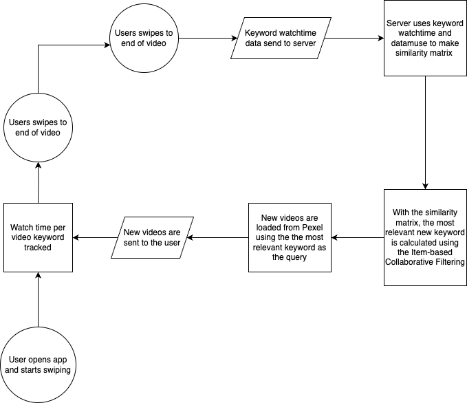

# tiktok-ai

## Test the app

[Demo URL](https://tiktok-ai.vercel.app/)

The TikTok demo app works best on mobile.

## Goal

The purpose of the TikTok demo app is to test our research results. The main topics we wanted to test are the algorithm and the addictive nature of TikTok.

## Algorithm introduction

As mentioned before, TikTok uses *Neighborhood-based Collaborative Filtering* and *Item-based Collaborative Filtering*. In our demo app, we don't have any user data so trying *Neighborhood-based Collaborative Filtering* was not possible. *Item-based Collaborative Filtering* also relies on user data but we were able to use an alternative dataset to circumvent this issue.

## The flow of the app



A diagram is the best way to show the flow of the app. As you can see, it's cyclical which hints towards the addictiveness of TikTok. The user will keep on getting more and more curated videos.

## Filling in the gaps

Our demo app only covers the core part of TikTok, swiping from one video to another and getting an infinite amount of curated videos. We don't have videos made by users and we don't have watchtime data from other users. To cover these gaps, we used the following APIs:

* [Pexels API](https://www.pexels.com/api/): a free to use videos API that allowed us to get videos by keyword. Tags were not given but with [this code](https://github.com/lennertVanSever/tiktok-ai/blob/main/backend/tags.py) we were able to extract keywords from the url. The videos are not engaging which makes our app boring.

* [Datamuse API](https://www.datamuse.com/api/), also free to use. It's a word finding API. We used it for finding similar words of the video keywords. It will also give a score on how well the word matches the given word. It allowed us to build the similarity matrix without other user data. Not a perfect solution but a good starting point.

## Executing the algorithm

The first 3 videos are always the same videos. When the user starts swiping, the watchtime per keyword of every video is tracked. Once the end of the videos is reached, the watchtime data is sent to the server.

| Keyword     | Watchtime |
|-------------|-----------|
| cloud       | 1.83s     |
| blue        | 1.83s     |
| green       | 1.83s     |
| paint       | 1.83s     |
| underwater  | 1.83s     |
| tagging     | 1.59s     |
| pictures    | 1.59s     |
| mood        | 1.59s     |
| board       | 1.59s     |
| essence     | 1.59s     |

When the server receives the data it will first look for related words using the Datamuse API. It has to do this for every keyword which is often slow. With the related words and scores, a similarity matrix will be built. The next step is to use the keyword watchtime data and similarity matrix to get the most relevant next keyword. This is done by executing the *Item-based Collaborative Filtering* algorithm. It sounds complicated but actually it's only 8 lines of code.

```python
def find_most_relevant_keyword(keyword_watch_data, similarity_matrix):
    keyword_scores = {}
    for keyword, watch_time in keyword_watch_data.items():
        similar_words = similarity_matrix.get(keyword, {})
        for similar_word, score in similar_words.items():
            if similar_word not in keyword_watch_data:
                keyword_scores[similar_word] = keyword_scores.get(
                    similar_word, 0) + (score * watch_time)
    most_relevant_keyword = max(
        keyword_scores, key=keyword_scores.get) if keyword_scores else None
    return most_relevant_keyword, keyword_scores.get(most_relevant_keyword, 0)
```

Now that we have the most relevant keyword, we can use it to get more videos from Pexel. This is served to the frontend where the whole cycle can start again.

## Optimizations

The scope of this demo app is only academic. Some improvements could be made to make the app smoother:

- Currently, the app will only start to load the new videos when the user has reached the end of the videos. This is suboptimal in an infinite scrolling experience like TikTok. The system should already load in new videos once the user is getting closer to the end so that there is a constant stream.
- The similarity matrix is calculated on run time which is unnecessary. It could be pre-calculated to make the algorithm faster. This optimization can probably reduce the load time by more than 90%.
- Removing statistics, now there is some logging and a statistics page for research purpose. Not necessary but it will unlikely impact performance.

## Tech Stack

- Frontend: HTML, CSS and Vanilla Javascript. Only library used is [Swiper](https://swiperjs.com/).
- Backend: Python. Libraries used are Flask and Request.

This app does not have a database to store data, the backend is also redundant since everything could have been run directly from the frontend. We decided to use a backend since we could write it in Python, a language used in this Postgraduate.

## Demo Conclusion

The TikTok demo app highlights how the TikTok algorithm works. In its simplest form, it is not complicated. There is no black box and everything can be explained. However, this app is unfit for production. It should rely on user content and user data. It doesn't take benefit of social data.

## Sources

- ChatGPT conversation to create the first version of the frontend: [Chat History](https://chat.openai.com/share/4ef4acad-5c27-4adb-964f-f5b59861cfba)
- Vertical video source for frontend: [Pexels.com](https://www.pexels.com/search/videos/vertical/)
- Second ChatGPT conversation to create an improved version of the frontend: [Chat History](https://chat.openai.com/share/f2c7408c-272c-4f83-bbf7-0d1de0fb6609)
- Third ChatGPT conversation to implement backend algorithm: [Chat History](https://chat.openai.com/share/cbb38538-bbc3-40e2-b0cf-9d5c83938000)
- Fourth ChatGPT conversation to implement the stats, unfortunately, it got lost by sending a huge message
